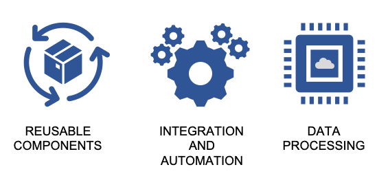
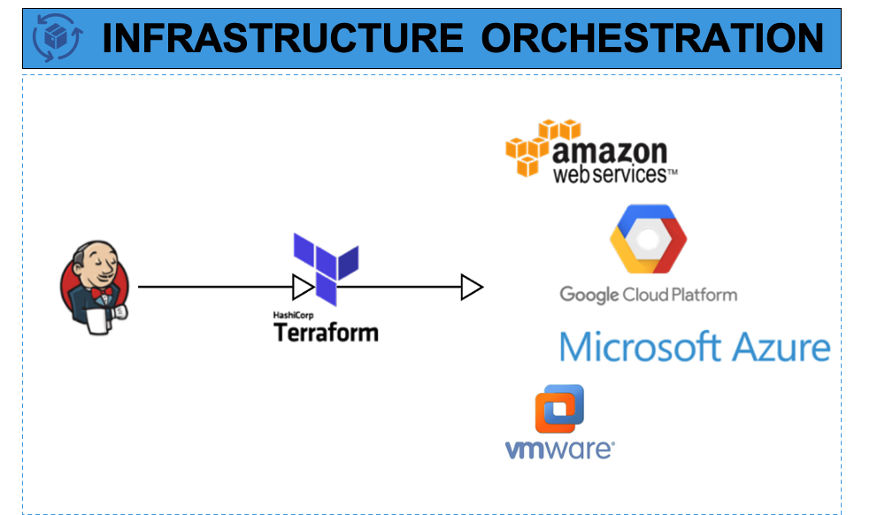
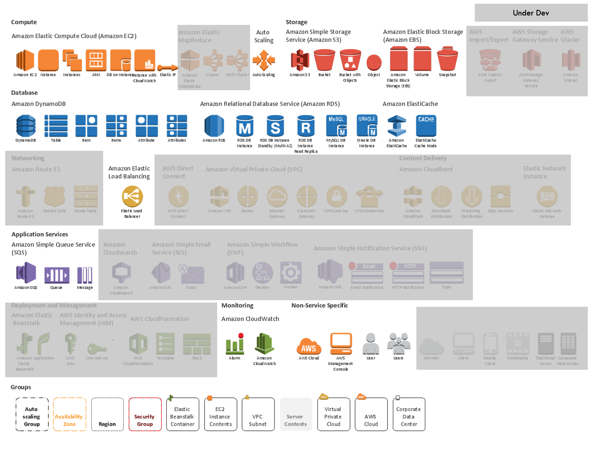

# Machine Factory - Write Once Deploy Everywhere!

Machine Factory (MF) is a Infrastructure as Code (IaC) blueprint for Cloud operations

MF is a open-source SDK library and a Orchestration System to manage infrastructure resources such as containers, virtual machines, databases and virtual data centers from public cloud providers programmatically.
There is also a command language interface (CLI) for infrastructure management and is based in technologies like terraform, shell, python, docker and others.
It can be used by engineers with roles of Sysops, DevOps or System Administrators to manage and deploy components with reusable and customizable Infrastructure-as-Code blueprints.





## Resources that can be managed

* Compute: AWS EC2 
* Database: AWS RDS
* Storage: AWS S3
* Network: AWS VPC (Under development)
* Orchestration: EKS and ECS (Under development)
* Queue: AWS DynamoDB
* Cache: Elasticache Redi and Memcached

### High Level Architecture Diagram








## Partners

This work was made possible by


## News

* Bug fix challenges
* Winners for sprint 21
* Version 0.02 stable release
* Be our beta tester and win prizes!


## Blueprints

```hcl-terraform
module "ec2_vm_002" {
  source = "../modules/compute/ec2_std"
  namespace = var.namespace
  name = format("%s/%s",var.namespace,"vm_002")
  id = format("%s/%s",var.namespace,"vm_002")
  vm_key = aws_key_pair.deploy.key_name
  region = var.region
  user_data = "${file("./files/install.sh")}"
  instance_profile = var.instance_profile
  firewall_id = var.firewall_id
  subnet_id = var.subnet_id
  quant_inst = var.quant_inst
  disk_size = "50"
  #os_image = "ami-0675b14d0cce38612"
  os_image = "ami-06fae82181843e5cd"
}

output "ec2_vm_002" {
  value = module.ec2_vm_002
}
```

```hcl-terraform
module "sql-rds" {
  source = "../modules/database/core/rds"
  namespace = var.namespace
  db_name = "mocksql"
  db_username = "sqluser"
  db_password = "hausdhf&hsa2212!"
  db_subnet_group_name = "service-oracle-rds-subnet"
  parameter_group_name = "service-mocksql"
  engine = "oracle-se2"
  engine_version = "12.2.0.1.ru-2019-04.rur-2019-04.r1"
  tags = var.tags
  instance_class = "db.m4.large"
  license_model = "license-included"
  firewall-sg-id = ["sg-0469e493b1366dbdf"]
  db_port = "1521"
}

output "sql-rds" {
  value = module.sql-rds
}

```

```hcl-terraform
module "cache-HA-redis-cluster" {
  source = "../modules/storage/core/elasticache-HA-cluster-redis"
  namespace = var.namespace
  cache_name = "HA-cache-mk"
  security_group_ids_list = ["sg-0270a8870e8520cdc"]
  cache_subnet_group_name = "service-cache-subnet-group"
  tags = var.tags
}

output "cache-HA-redis-cluster" {
  value = module.cache-HA-redis-cluster
}
```

```hcl-terraform
module "dynamodb" {
  source = "../modules/database/core/dynamodb"

  db_attributes = {
    id    = "S"
    ts = "N"
  }
  primary_key = "id"
  secondary_key = "ts"
  tags = var.tags
  namespace = var.namespace
  table_name = "nosqlDB-mock"
}

output "dynamodb" {
  value = module.dynamodb
}

```

## Built With

* [Terraform](http://terraform.io/) -  Infrastructure as Code
* [aws-cli](https://docs.aws.amazon.com/cli/index.html) - AWS Command Line Interface
* [docker](https://www.docker.com/) - Container Platform
* [docker-compose](https://docs.docker.com/compose/) - Container Deploy Tool


## Design Principles

* Simple to read, modify and run
* Easy to extend by making reusable programmable components 
* Test and Quality Control
* Secure and Resilient Architecture
* Object-Oriented through modules and code templates


## Contributing

There are several ways to help the project

* Testing: Contact testers@systemcall.info for more information
* Code: Please read [CONTRIBUTING.md]() for details on our code of conduct, and the process for submitting pull requests to us.
* Sponsor: Contact partners@systemcall.info for more information
* Subscription: Contact comercial@systemcall.info for more information


 
## Overview
Allow to easily Create/Update/Replace/Delete infrastructure resources classes (such as databases, middleware queues, memory caches, file services ,etc.) through a mark-up template language.

Resource class file-server (AWS S3 Bucket):

```hcl-terraform
module "buckets3-backend" {
  source = "../modules/fileserver/core/bucket-s3"

  namespace = var.namespace
  partition-key = "s3-fileserver-mock"
  tags = var.tags

}

output "buckets3"{
  value = module.buckets3-backend
}
```

```hcl-terraform
############################
# User/Service Credentials #
# Module: CreateAcessProfile
############################

module "CreateAcessProfile_AdminProfile" {
  source = "../modules/security/ext/auth/CreateAccessProfile"
  username = "admin-user-app-mock"
  namespace = var.namespace
  target_service = "ec2.amazonaws.com"
  access_level = "Allow"
  role_name = "admin-role-app-mock"
}

output "AuthProfile_AdminProfile" {
  value = module.CreateAcessProfile_AdminProfile
}


###
# Policy S3 - Default Backend Storage
# Module: GrantAccessTo_ACL
###

module "S3_GrantAccessTo_ACL_Adm" {
  source = "../modules/security/ext/auth/GrantAccessTo_ACL"
  policy_name = "s3_acl"
  namespace = var.namespace
  access_level = "Allow"
  target_service = "s3"
  operation_list = ["*"]
  prefix = ""

  target_resource_id_list = ["default-backend-storage*", "default-backend-storage/*"]

  #target_resource_id_list = ["default-backend-storage-${random_integer.value.id}*", "default-backend-storage-${random_integer.value.id}/*"]
  #target_resource_id_list = ["bucketTestA*", "bucketTestA-010111*"]

  region = ""
  account-id = ""

  target_user_name = module.CreateAcessProfile_AdminProfile.aws-user.user.name
  target_role_name = module.CreateAcessProfile_AdminProfile.aws-role.access_role.name
}

output "S3_AcessControl_PolicyRule_Adm" {
  value = module.S3_GrantAccessTo_ACL_Adm.policy
}
```

Input parameters (terraform.tfvars):

```yaml
profile = "infra-deploy-admin-lab"
region = "us-east-1"
namespace = "service"
account-id = "00000000"
tags = {
    BusinessUnit       = "ACME LTDA"
    ComplianceList     = ""
    ComplianceRequired = "0"
    CriticalLevel      = "9"
    Email              = "l-acme@acme.com"
    EscalationList     = "userid1/userid2/userid3"
    FilaIm             = "l-acme"
    Product            = "ACME Product"
    Slack              = "acme-prod"
    Team               = "acme-devops"
}

```

## Deployment

To deploy using the CLI use the commands bellow under the ./sdk/**LAYER-NAME**

``` 
# configure/setup service environment

# security & network
cfg-srv init security

# create lab environment

srv-adm security bootstrap lab
cfg-srv bootstrap security

# deploy & remove service environment

srv-adm security status lab
srv-adm security deploy lab
srv-adm security remove lab


# infra
# configure/setup service environment

cfg-srv init infra

# create lab environment

srv-adm infra bootstrap lab

# deploy & remove service environment

srv-adm infra status lab
srv-adm infra deploy lab
srv-adm infra remove lab


```

To deploy using the start-workflow docker container edit the *./utils/iaas-tool/docker-compose.yml* :

```yaml
version: "3"
services:
  infra-workflow-manager:
    build: srv


    # infra
    # configure/setup service environments

    #command: ./tmp/init.sh cfg-srv init infra

    # create lab environments

    #command: ./tmp/init.sh srv-adm infra bootstrap lab

    # deploy & remove service environments
    #command: ./tmp/init.sh srv-adm infra init lab

    #command: ./tmp/init.sh srv-adm infra status lab
    command: ./tmp/init.sh srv-adm infra deploy lab
    #command: ./tmp/init.sh srv-adm infra remove lab

    ...

```
Run the script to deploy the container

```bash
 $ ./start-workflow.sh
```

## Getting Started

These instructions will get you a copy of the project up and running on your local machine for development and testing purposes. See deployment for notes on how to deploy the project on a live system.

### Prerequisites

It's possible to run this project in two ways. Run locally the **cfg-srv/srv-adm** tools or through a **docker-container**.

For **local** run: - example on Centos 7 (see official docs for other OS distributions).
Install pip package manager and the aws-cli tool
```
yum -y install epel-release
yum -y install python-pip wget unzip tree
pip install awscli
```
Install terraform.
```
wget https://releases.hashicorp.com/terraform/0.12.1/terraform_0.12.1_linux_amd64.zip
unzip ./terraform_0.12.1_linux_amd64.zip -d /usr/local/bin/
chmod +x /usr/local/bin/terraform
terraform -v
```

For **docker** see the [official instructions] (https://docs.docker.com/v17.12/install/)

Setting AWS Credentials - [official docs] (https://docs.aws.amazon.com/sdk-for-java/v1/developer-guide/setup-credentials.html)

Setting your credentials for use can be done in a number of ways, but here are the recommended approaches:
Set credentials in the AWS credentials profile file on your local system, located at:
```
~/.aws/credentials on Linux, macOS, or Unix
C:\Users\USERNAME\.aws\credentials on Windows
```

This file should contain lines in the following format:

```
[default]
aws_access_key_id = your_access_key_id
aws_secret_access_key = your_secret_access_key
```
Substitute your own AWS credentials values for the values your_access_key_id and your_secret_access_key.


## Core components


| File/Dir  | Description |
| ------------- | ------------- |
| sdk/  | Core component which contains the source-code for all tools,scripts and templates|
| sdk/modules/  | Source-code for reusable infrastructure modules |
| sdk/shared/| Shared/Common configuration files between all services and environments |
| sdk/test/| Mock workflow files for test |
| sdk/_service/  | Service workspace |
| sdk/_service/envs/*/| A service can have multiple environments like dev, stage, qa, prod...|
| sdk/_service/envs/*/backend.tf | Terraform configuration file that store and manage the infra. state|
| sdk/_service/envs/*/input_parameters.tfvars| Input parameters for dynamic environment variables |
| sdk/security/| Privileged workspace for security and network resources deployment|
| sdk/infra/| General purpose infrastructure resource workflow manager|
| sdk/_service/srv-adm.sh  | Service Deployment tool |
| sdk/_service/cfg-srv.sh  | Service Configuration tool |
| utils/ | helper tools to use and manage the deployment pipeline |
| utils/iaas-tool | docker container tool to automate task execution |


## Authors

* **Matheus S. Lima**

See also the list of [contributors.md]() who participated in this project.

## License

 Server Side Public License
